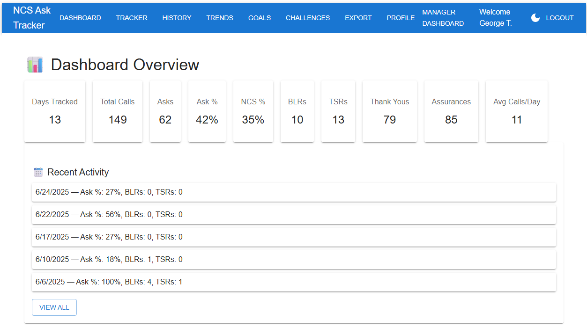
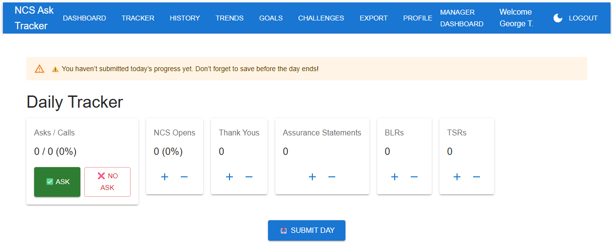
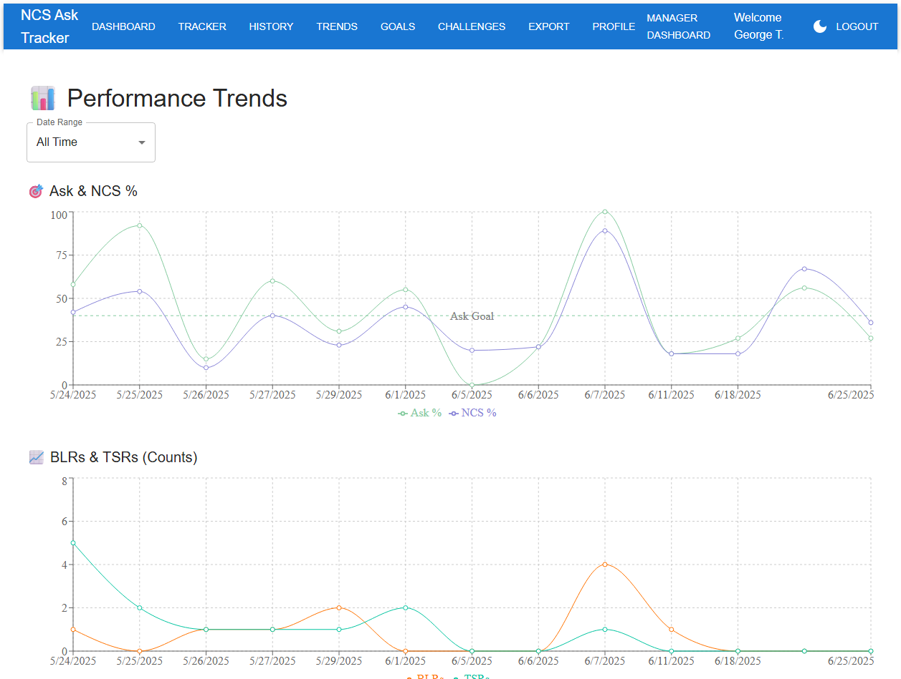

# AskTracker
A full-stack MERN application that tracks client behaviors to improve onboarding and lead generation performance.

- [Overview](#overview)  
- [Features](#features)  
- [Tech Stack](#tech-stack)  
- [Screenshots](#screenshots)  
- [Getting Started](#getting-started)  
- [Demo](#demo)  

## Overview
One of the best ways to achieve your goals or KPI's is to set SMART goals.  When it comes to onboarding and generating leads the goal might be 5 leads, but you can't make someone sign up.  This tool helps track the behaviors to properly welcome, onboard, and generate leads which include thanking clients for their business, assuring them you can handle their inquiry, and tracking whether or not you have asked probing questions to the client to try and uncover their unstated need.  These are behaviors that are within your control and they are behaviors that are much easier to track with this application.

## Features
- **Daily Logging**
  - Track asks, NCS opens, leads (BLR/TSR), thank-yous, assurances
- **Analytics**
  - Call percentages (% asks, % assurances) with historical trends
- **Gamification**
  - Streak tracking, badges, weekly goals, team competitions
- **Reports**
  - Export to CSV or PDF (with charts & highlights)
- **Manager Dashboards**
  - Leaderboards, team challenges, performance tracking

## Tech Stack
- **Frontend:** React, Material UI, Recharts  
- **Backend:** Node.js, Express  
- **Database:** MongoDB, Mongoose  
- **Other:** Axios, jsPDF, Docker (planned), GitHub Actions (CI/CD)  

## Screenshots

*Dashboard showing Ask %, Open %, and weekly goal progress.*
   - 

*Section to input data and keep pulled up while on phone calls.*


## Getting Started

1. Clone the repo
   - ```bash
   - git clone https://github.com/georgeterhune/ncs-ask-tracker.git

2. Install Dependencies
   - cd client && npm install
   - cd ../server && npm install

3. Start the development servers
   - # in one terminal
   - cd server && npm start
   - # in another
   - cd client && npm start

## Demo
